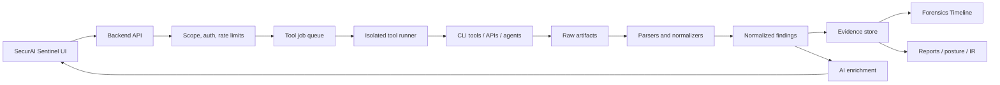

# Real Security Tool Integration Plan

The future direction should be: real tool execution first, AI analysis second. AI should explain, prioritize, correlate, and generate remediation from evidence produced by real scanners, sensors, and forensic tools.

## North Star Architecture

## Core Backend Components to Add

| Component | What It Does |
| --- | --- |
| Tool registry | Defines each tool, allowed modes, required binaries, version checks, safe arguments, output parser, and team ownership. |
| Job queue | Runs long scans asynchronously, supports cancel/retry/progress, prevents frontend timeouts. |
| Scope manager | Stores authorized targets, approved scan types, time windows, and active/passive mode. |
| Runner sandbox | Executes tools with least privilege, resource limits, timeouts, and isolated working directories. |
| Artifact store | Keeps raw XML/JSON/PCAP/log output with hashes for auditability. |
| Normalized finding schema | Converts all tools into consistent fields: title, severity, evidence, affected asset, CVE/CWE/MITRE, confidence, remediation, rawRef. |
| Parser library | Tool-specific parsers for XML, JSONL, SARIF, EVTX, EVE JSON, Zeek logs, Nmap XML, ZAP JSON, Nuclei JSONL. |
| AI enrichment layer | Summarizes and correlates already-produced evidence instead of inventing primary findings. |
| Audit log | Records who ran what, against which target, with which options, and what was produced. |

## Priority Phases

### Phase 1: Foundation

1. Add `INTERNAL_API_TOKEN` enforcement by default and pass the token from the frontend.
2. Add a `tool_runs` backend model or local persistence file for job state.
3. Create `/tools`, `/tools/check`, `/tools/run`, `/tools/runs/:id`, and `/tools/runs/:id/artifacts` endpoints.
4. Add a normalized finding type shared between frontend and backend.
5. Add target authorization and scan-scope confirmation before any active scan.

### Phase 2: Replace Current Recon and Web Checks

| Current Feature | Tool Replacement |
| --- | --- |
| Port Scanner / Network Watchtower port probes | Nmap first; optionally Naabu or RustScan for high-speed discovery under strict scope. |
| WebSec Ops subdomains | Subfinder and Amass, with crt.sh as a fallback source. |
| WebSec Ops headers and tech probing | ProjectDiscovery httpx and OWASP ZAP passive scan. |
| WebSec Ops SSL | testssl.sh or SSLyze, plus current `ssl-checker` as lightweight fallback. |
| Vulnerability Analysis | Nuclei, OWASP ZAP, Greenbone/OpenVAS, and Nmap NSE scripts. |

### Phase 3: Add AppSec and DevSecOps

| Capability | Tools |
| --- | --- |
| SAST | Semgrep |
| Secret scanning | Gitleaks |
| Container, filesystem, IaC, SBOM scanning | Trivy, Syft, Grype |
| Web DAST | OWASP ZAP, Nuclei |
| Dependency intelligence | OSV-Scanner, npm audit, pip-audit |

### Phase 4: Add Blue Team and DFIR

| Capability | Tools |
| --- | --- |
| Endpoint telemetry | osquery and Wazuh agents |
| Fleet response and collection | Velociraptor |
| Network detection | Suricata and Zeek |
| Packet inspection | TShark/Wireshark CLI |
| Malware triage | YARA, capa, FLOSS, ClamAV |
| Memory forensics | Volatility 3 |
| Timeline forensics | Plaso/log2timeline |
| Detection rules | Sigma/pySigma |

### Phase 5: Case Management and Threat Intel

| Capability | Tools / Platforms |
| --- | --- |
| Case management | TheHive |
| Analyzer/responders | Cortex, where compatible with your deployment |
| Threat intelligence sharing | MISP |
| Vulnerability management | Greenbone Community Edition/OpenVAS |
| Controlled exploit validation | Metasploit Framework, only in explicit lab or approved full-mode missions |

## Tools to Install

### Base System

| Tool | Why |
| --- | --- |
| Node.js / npm | Existing frontend and backend runtime. |
| Git | Source control, tool installs, rule/template updates. |
| Docker Desktop | Easiest safe path for ZAP, Greenbone, TheHive, MISP, and disposable scan runners. |
| WSL2 Ubuntu | Recommended on Windows for Linux-native tools such as Zeek, Suricata, Plaso, and many Go/Python security CLIs. |
| Go | Required for many ProjectDiscovery tools. |
| Python 3.10+ and pipx/uv | Required for Semgrep, Volatility, Plaso, and helper parsers. |

### Red Team and Attack Surface

| Tool | Use in SecurAI Sentinel |
| --- | --- |
| Nmap | Authoritative port/service/version scan; parse XML into Port Scanner, Red Team Agent, Watchtower, and Zero Trust Builder. |
| ProjectDiscovery Nuclei | Template-based vulnerability checks; parse JSONL into Vulnerability Analysis and CVE Intel Hub. |
| ProjectDiscovery Subfinder | Passive subdomain enumeration for WebSec Ops and Red Team Agent. |
| ProjectDiscovery httpx | Probe HTTP services, titles, status, tech, TLS, response fingerprints. |
| ProjectDiscovery Naabu | Fast port discovery before deeper Nmap scans. |
| OWASP ZAP | Web DAST, passive scan, spider, active scan under approved scope, API-driven reports. |
| Greenbone Community Edition/OpenVAS | Deeper vulnerability management scanning. |
| Metasploit Framework | Controlled exploit validation in labs or explicitly authorized full-mode missions. |

### Blue Team, SOC, and DFIR

| Tool | Use in SecurAI Sentinel |
| --- | --- |
| Wazuh | Real SIEM/XDR backend for endpoint alerts, inventory, file integrity, and compliance checks. |
| osquery | Lightweight endpoint SQL telemetry feeding Fleet EDR. |
| Velociraptor | Endpoint collection, hunts, triage artifacts, and response workflows. |
| Suricata | IDS/IPS events from live traffic or PCAPs, output EVE JSON to Packet Analyzer and Forensics Timeline. |
| Zeek | Rich network metadata logs from PCAP/live traffic, excellent for forensics and threat hunting. |
| TShark | CLI packet decoding and field extraction for Packet Capture Analyzer. |
| YARA | Malware and file rule scanning. |
| Volatility 3 | Memory dump analysis for DFIR workflows. |
| Plaso/log2timeline | Super timeline creation from disk images, folders, and logs. |
| Sigma/pySigma | Convert detection rules into SIEM-specific queries. |

### AppSec and DevSecOps

| Tool | Use in SecurAI Sentinel |
| --- | --- |
| Semgrep | Replace AI-only code review with rule-based SAST evidence. |
| Gitleaks | Detect secrets in source, history, and uploaded projects. |
| Trivy | Scan containers, filesystems, repositories, IaC, Kubernetes, and SBOMs. Avoid compromised versions noted in current advisories. |
| Syft / Grype | SBOM generation and vulnerability matching. |
| OSV-Scanner | Open-source dependency vulnerability lookup. |

## Feature-by-Feature Integration Plan

| Feature | First Real Tool Integration | How It Works |
| --- | --- | --- |
| Port Scanner | Nmap XML | Run `nmap -sV -O --reason -oX -` under scope; parse ports/services and feed existing risk UI. |
| Vulnerability Analysis | Nuclei JSONL + ZAP JSON | Scan approved targets, normalize findings, let AI explain impact and remediation. |
| WebSec Ops | httpx, Subfinder, ZAP, SSLyze/testssl.sh | Replace individual fetches with deeper probe outputs and passive DAST evidence. |
| AI Red Team Agent | Tool registry | Planner selects approved tools; executor runs real adapters and uses AI only for interpretation/synthesis. |
| Packet Analyzer | TShark, Zeek, Suricata | Use TShark for packet details, Zeek for metadata logs, Suricata for signatures. |
| Fleet EDR | osquery/Wazuh/Velociraptor | Replace simulated endpoint telemetry with agent data and response actions. |
| Malware/Keylogger | YARA, capa, FLOSS, ClamAV, osquery | Upload sample metadata or endpoint evidence; rule scans provide primary evidence. |
| CryptoVault | Semgrep, Gitleaks, Trivy | Scan uploaded code/projects before encryption or export; generate SARIF-style findings. |
| CVE Intel Hub | NVD + CPE mapping + Nuclei templates | Link discovered services/packages to CVEs and available checks. |
| Dark Web Monitor | HIBP + MISP | Keep HIBP for breach checks; add MISP for internal threat intel events and attributes. |
| Forensics Timeline | Plaso, Zeek, Suricata, Wazuh | Import timeline/events from real artifacts, preserve source references. |
| IR Playbook | TheHive | Generate response steps, then create/update cases and tasks in TheHive. |
| Canary Factory | OpenCanary / Canarytokens API | Register tokens with a real backend and ingest trigger events. |
| Zero Trust Builder | Tool findings + policy validation | Generate policies from real Nmap/ZAP/Wazuh/Trivy findings, validate config syntax with real linters. |

## Safety Controls for Offensive Tools

1. Require an explicit authorization checkbox and saved scope for active scans.
2. Block public IP ranges by default unless the user adds them to an approved target list.
3. Split modes into Passive, Active Safe, Active Intrusive, and Lab Exploit.
4. Rate-limit scans and cap concurrency per target.
5. Log all tool invocations and raw outputs.
6. Add a dry-run preview that shows exact commands before execution.
7. Run exploit validation only in lab containers or explicit written-scope mode.
8. Keep secrets out of command arguments where possible; pass via environment or config files with cleanup.

## Current Official References

- Nmap install and verification docs: [nmap.org/book/install.html](https://nmap.org/book/install.html), [nmap.org/download.html](https://nmap.org/download.html)
- OWASP ZAP docs, getting started, Docker, and API: [zaproxy.org/docs](https://www.zaproxy.org/docs/), [Getting Started](https://www.zaproxy.org/getting-started/), [Docker Guide](https://www.zaproxy.org/docs/docker/about/), [API](https://www.zaproxy.org/docs/api/)
- ProjectDiscovery Nuclei, httpx, Subfinder, Naabu: [Nuclei docs](https://docs.projectdiscovery.io/opensource/nuclei), [Nuclei install](https://docs.projectdiscovery.io/tools/nuclei/install), [httpx install](https://docs.projectdiscovery.io/tools/httpx/install), [Subfinder](https://docs.projectdiscovery.io/tools/subfinder), [Naabu GitHub](https://github.com/projectdiscovery/naabu)
- Wazuh install guide: [documentation.wazuh.com/current/installation-guide](https://documentation.wazuh.com/current/installation-guide/index.html)
- osquery Windows and Linux install docs: [Windows](https://osquery.readthedocs.io/en/stable/installation/install-windows/), [Linux](https://osquery.readthedocs.io/en/stable/installation/install-linux/)
- Zeek, Suricata, and TShark docs: [Zeek install](https://docs.zeek.org/en/v7.2.2/install.html), [Suricata install](https://docs.suricata.io/en/latest/install.html), [TShark manual](https://www.wireshark.org/docs/man-pages/tshark.html)
- Semgrep, Gitleaks, Trivy, and YARA docs: [Semgrep CLI](https://semgrep.dev/docs/getting-started/cli), [Gitleaks](https://github.com/gitleaks/gitleaks), [Trivy install](https://trivy.dev/docs/latest/getting-started/installation/), [YARA getting started](https://yara.readthedocs.io/en/stable/gettingstarted.html)
- Trivy 2026 supply-chain advisory: [GHSA-69fq-xp46-6x23](https://github.com/aquasecurity/trivy/security/advisories/GHSA-69fq-xp46-6x23)
- DFIR and case platforms: [Velociraptor docs](https://docs.velociraptor.app/docs/), [Volatility 3 docs](https://volatility3.readthedocs.io/), [Plaso docs](https://plaso.readthedocs.io/), [TheHive install methods](https://docs.strangebee.com/thehive/installation/installation-methods/), [MISP install docs](https://misp.github.io/MISP/INSTALL.kali.html)
- Greenbone and Metasploit: [Greenbone Community Edition docs](https://greenbone.github.io/docs/latest/), [Metasploit getting started](https://docs.metasploit.com/docs/using-metasploit/getting-started/), [Metasploit nightly installers](https://docs.metasploit.com/docs/using-metasploit/getting-started/nightly-installers.html)

